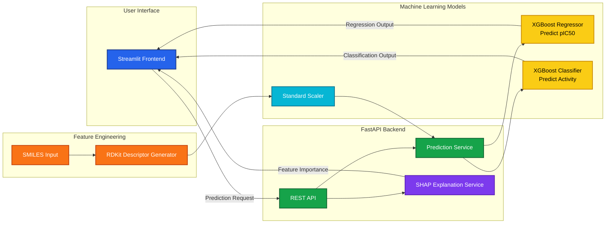
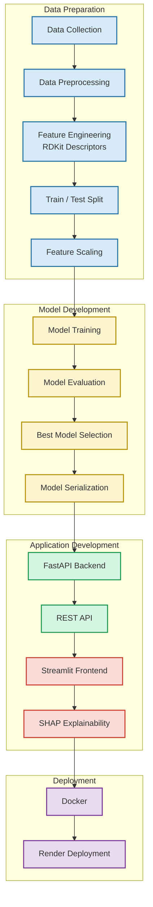

[](https://python.org)
[](https://fastapi.tiangolo.com/)
[](https://streamlit.io/)
[](https://www.rdkit.org/)
[](https://www.docker.com/)
[](https://en.wikipedia.org/wiki/Drug_discovery)
[](https://en.wikipedia.org/wiki/Computational_chemistry)
[](https://xgboost.ai/)
[](https://render.com/)
[](https://streamlit.io/cloud)


## QSAR Prediction System using Machine Learning  

Predict molecular bioactivity from chemical structures using Machine Learning and Computational Chemistry.

- This project implements an end-to-end QSAR (Quantitative Structure–Activity Relationship) workflow that predicts the biological activity of molecules from their SMILES representation. 

- It combines Machine Learning, RDKit, FastAPI, Streamlit, and Docker to provide a complete prediction application from model training to deployment.


--------------------------------------------------------------------------

## Project Architecture




-------------------------------------------------------------------------- 

# Project Overview

The application predicts molecular bioactivity using two Machine Learning models.

**Regression Model**

- Predicts: pIC50 value of a molecule

**Classification Model**

Predicts whether a molecule is:

- Active
  
- Inactive

Users simply enter a SMILES string, and the application returns:

- Predicted pIC50
- Activity Classification
- SHAP Feature Explanation

  
# 📊 Dataset

Source: ChEMBL Database

Each molecule contains:

- SMILES representation
  
- Experimental pIC50 value

--------------------------------------------------------------------------


# What is QSAR?

- QSAR (Quantitative Structure-Activity Relationship) is a computational method that relates the chemical structure of molecules to their biological activity. 

- In this project, QSAR models are used to predict how strongly a molecule binds to the COX-2 enzyme, which is a target for anti-inflammatory drugs.


## Machine Learning Workflow




--------------------------------------------------------------------------


## 📊 Model Performance

### Data Overview

| Parameter | Value |
|-----------|-------|
| Data Source | ChEMBL Database |
| Target | COX-2 (Cyclooxygenase-2) |
| Total Molecules | 15,314 (raw) → 4,392 (cleaned) |
| Features | 8 RDKit Molecular Descriptors |
| Activity Classes | Active (28.8%), Moderate (56.7%), Inactive (14.5%) |

---

### Model Selection

After comparing multiple algorithms, **XGBoost** was selected for both regression and classification tasks based on performance metrics:

| Model Type | Algorithm | Metric | Value |
|------------|-----------|--------|-------|
| Regression (pIC50) | XGBoost Regressor | **R²** | **0.298** |
| | | RMSE | 0.985 |
| | | MAE | 0.762 |
| Classification | XGBoost Classifier | **AUC** | **0.771** |
| | | Accuracy | 75.8% |
| | | Precision | 0.678 |
| | | Recall | 0.435 |
| | | F1-Score | 0.530 |

---

### Descriptors Used

The model was trained on these 8 molecular descriptors:

| Descriptor | Description |
|------------|-------------|
| **MolWt** | Molecular weight (g/mol) |
| **NumHDonors** | Number of hydrogen bond donors |
| **NumHAcceptors** | Number of hydrogen bond acceptors |
| **TPSA** | Topological polar surface area (Ų) |
| **NumRotatableBonds** | Number of rotatable bonds |
| **RingCount** | Total number of rings |
| **HeavyAtomCount** | Number of non-hydrogen atoms |
| **NumAromaticRings** | Number of aromatic rings |

---

### Activity Class Distribution

| Class | Count | Percentage |
|-------|-------|------------|
| **Active** (pIC50 ≥ 7.0) | 1,264 | 28.8% |
| **Moderate** (pIC50 5.0–7.0) | 2,492 | 56.7% |
| **Inactive** (pIC50 < 5.0) | 636 | 14.5% |

---

### Evaluation Metrics Summary

| Task | Best Model | Key Metric | Value |
|------|------------|------------|-------|
| **Regression** | XGBoost Regressor | R² | **0.298** |
| **Classification** | XGBoost Classifier | AUC | **0.771** |


--------------------------------------------------------------------------


# Project Structure

```text
qsar_prediction_system/
│
├── backend/                      # FastAPI backend
│   ├── api/                      # API routes & schemas
│   ├── services/                 # Prediction & SHAP services
│   └── main.py                   # FastAPI entry point
│
├── frontend/                     # Streamlit frontend
│   ├── pages/                    # Application pages
│   ├── components/               # Reusable UI components
│   └── app.py                    # Streamlit entry point
│
├── models/                       # Trained models & artifacts
│   ├── qsar_best_regressor.pkl
│   ├── qsar_best_classifier.pkl
│   ├── scaler_qsar.joblib
│   ├── qsar_feature_names.txt
│   └── shap_background.npy
│
├── notebooks/                    # Jupyter notebooks
├── config/                       # Configuration files
├── deployment/                   # Docker & deployment configs
├── scripts/                      # Utility scripts
├── tests/                        # Unit tests
│
├── Dockerfile
├── render.yaml
├── requirements.txt
├── README.md
└── .gitignore
```


--------------------------------------------------------------------------


## Tech Stack

## Backend

| Technology | Purpose |
|------------|---------|
| FastAPI | REST API framework |
| RDKit | Molecular descriptor generation |
| XGBoost | Regression & Classification models |
| Scikit-learn | Data preprocessing & feature scaling |
| SHAP | Explainable AI (Model Interpretability) |
| Uvicorn | ASGI server |

---

## Frontend

| Technology | Purpose |
|------------|---------|
| Streamlit | Interactive web application |
| Plotly | Interactive visualizations |
| Requests | Backend API communication |

---

## Data Science & Machine Learning

| Technology | Purpose |
|------------|---------|
| Python | Programming language |
| Jupyter Notebook | Model development & experimentation |
| NumPy | Numerical computing |
| Pandas | Data manipulation & analysis |
| Random Forest | Model benchmarking |
| XGBoost | Final selected ML model |
| LightGBM | Model benchmarking |

---

## Infrastructure & Deployment

| Technology | Purpose |
|------------|---------|
| Docker | Application containerization |
| Render | Backend deployment |
| Streamlit Community Cloud | Frontend deployment |
| Git | Version control |
| GitHub | Source code hosting & collaboration |


--------------------------------------------------------------------------

#  Live Demo

###  Frontend (Streamlit)

- **Streamlit App:**   https://qsar-ai-drug-predictor.streamlit.app/


###  Backend API (Render)

-  **Render Backend:**   https://qsar-ai-drug-predictor.onrender.com/

-  https://qsar-ai-drug-predictor.onrender.com/docs

 
#  Important Note

This application is deployed using **free cloud services**.

After a period of inactivity, the backend may automatically go to sleep.

Before using the Streamlit application:

1. Open the **Backend API (Render)** link.
2. Wait **30–60 seconds** for the backend to wake up.
3. Refresh or open the **Streamlit application**.
4. Predictions and SHAP explanations should now work normally.

---

# 💻 Installation

## Prerequisites

Make sure you have the following installed:

- Python **3.12+**
- pip (Python Package Manager)
- Git *(optional, for cloning the repository)*

---

## Step 1:  Clone the Repository

```bash
git clone https://github.com/UzairRan/QSAR-AI-Drug-Predictor.git

cd QSAR-AI-Drug-Predictor
```

---

## Step 2:  Create a Virtual Environment

### Windows

```bash
python -m venv venv
venv\Scripts\activate
```

### macOS / Linux

```bash
python3 -m venv venv
source venv/bin/activate
```

---

## Step 3: Install Dependencies

```bash
pip install -r requirements.txt
```

---

## Step 4: Download Model Files

Place the following files inside the **models/** directory.

```
models/
├── qsar_best_regressor.pkl
├── qsar_best_classifier.pkl
├── scaler_qsar.joblib
├── qsar_feature_names.txt
└── shap_background.npy
```


# ▶️ Running the Application

## Step 1  Start the Backend (FastAPI)

```bash
uvicorn backend.main:app --reload
```

Backend will be available at:

```
http://localhost:8000
```

API Documentation:

```
http://localhost:8000/docs
```

---

## Step 2: Start the Frontend (Streamlit)

```bash
streamlit run frontend/app.py
```

Frontend will be available at:

```
http://localhost:8501
```

---

# 🔬 Making Predictions

## Option 1: Using the REST API

```bash
curl -X POST http://localhost:8000/api/v1/predict \
-H "Content-Type: application/json" \
-d '{"smiles":"Cc1ccc(-c2cc(C(F)(F)F)nn2-c2ccc(S(N)(=O)=O)cc2)cc1"}'
```

---

## Option 2: Using the Web Application

1. Open the Streamlit application.
2. Enter a valid **SMILES** string.
3. Click **Predict**.
4. View:
   - Predicted pIC50 value
   - Activity Class (Active / Inactive)
   - Confidence Score
   - SHAP Feature Explanations


--------------------------------------------------------------------------


# API Endpoints


| Method | Endpoint | Description |
|--------|----------|-------------|
| `GET` | `/` | API information |
| `GET` | `/health` | Health check |
| `POST` | `/api/v1/predict` | Predict a single molecule |
| `POST` | `/api/v1/predict/batch` | Batch prediction |
| `POST` | `/api/v1/predict/upload` | Predict from uploaded CSV file |
| `POST` | `/api/v1/explain` | Generate SHAP explanation |
| `GET` | `/api/v1/models` | List available trained models |


--------------------------------------------------------------------------


##  Author

**Uzair Shafique**

- Pharm.D 
- Machine Learning 
- AI in Computational Chemistry

- **LinkedIn:**  https://www.linkedin.com/in/uzair-shafiq/ 

Built with ❤️ for the drug discovery Community and the use of AI and ML in Computational Chemistry.
  
