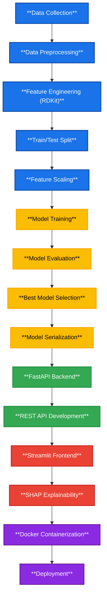

## QSAR Prediction System using Machine Learning  

Predict molecular bioactivity from chemical structures using Machine Learning and Computational Chemistry.

- This project implements an end-to-end QSAR (Quantitative Structure–Activity Relationship) workflow that predicts the biological activity of molecules from their SMILES representation. 

- It combines Machine Learning, RDKit, FastAPI, Streamlit, and Docker to provide a complete prediction application from model training to deployment.

--------------------------------------------------------------------------

--------------------------------------------------------------------------

# Project Overview

The application predicts molecular bioactivity using two Machine Learning models.

**Regression Model**

- Predicts: pIC50 value of a molecule

**Classification Model**

Predicts whether a molecule is:

- Active
  
- Inactive

Users simply enter a SMILES string, and the application returns:

- Predicted pIC50
- Activity Classification
- SHAP Feature Explanation

  
# 📊 Dataset

Source: ChEMBL Database

Each molecule contains:

- SMILES representation
  
- Experimental pIC50 value

--------------------------------------------------------------------------

--------------------------------------------------------------------------

# What is QSAR?

- QSAR (Quantitative Structure-Activity Relationship) is a computational method that relates the chemical structure of molecules to their biological activity. 

- In this project, QSAR models are used to predict how strongly a molecule binds to the COX-2 enzyme, which is a target for anti-inflammatory drugs.

# Project Architecture

--------------------------------------------------------------------------

--------------------------------------------------------------------------

## 📊 Model Performance

### Data Overview

| Parameter | Value |
|-----------|-------|
| Data Source | ChEMBL Database |
| Target | COX-2 (Cyclooxygenase-2) |
| Total Molecules | 15,314 (raw) → 4,392 (cleaned) |
| Features | 8 RDKit Molecular Descriptors |
| Activity Classes | Active (28.8%), Moderate (56.7%), Inactive (14.5%) |

---

### Model Selection

After comparing multiple algorithms, **XGBoost** was selected for both regression and classification tasks based on performance metrics:

| Model Type | Algorithm | Metric | Value |
|------------|-----------|--------|-------|
| Regression (pIC50) | XGBoost Regressor | **R²** | **0.298** |
| | | RMSE | 0.985 |
| | | MAE | 0.762 |
| Classification | XGBoost Classifier | **AUC** | **0.771** |
| | | Accuracy | 75.8% |
| | | Precision | 0.678 |
| | | Recall | 0.435 |
| | | F1-Score | 0.530 |

---

### Descriptors Used

The model was trained on these 8 molecular descriptors:

| Descriptor | Description |
|------------|-------------|
| **MolWt** | Molecular weight (g/mol) |
| **NumHDonors** | Number of hydrogen bond donors |
| **NumHAcceptors** | Number of hydrogen bond acceptors |
| **TPSA** | Topological polar surface area (Ų) |
| **NumRotatableBonds** | Number of rotatable bonds |
| **RingCount** | Total number of rings |
| **HeavyAtomCount** | Number of non-hydrogen atoms |
| **NumAromaticRings** | Number of aromatic rings |

---

### Activity Class Distribution

| Class | Count | Percentage |
|-------|-------|------------|
| **Active** (pIC50 ≥ 7.0) | 1,264 | 28.8% |
| **Moderate** (pIC50 5.0–7.0) | 2,492 | 56.7% |
| **Inactive** (pIC50 < 5.0) | 636 | 14.5% |

---

### Evaluation Metrics Summary

| Task | Best Model | Key Metric | Value |
|------|------------|------------|-------|
| **Regression** | XGBoost Regressor | R² | **0.298** |
| **Classification** | XGBoost Classifier | AUC | **0.771** |

  
